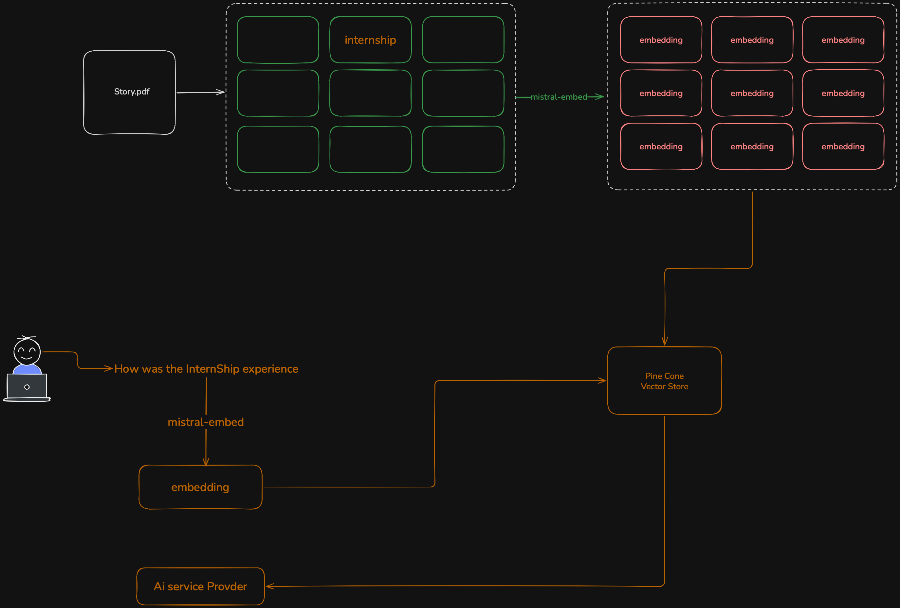

# RAG Pipeline: From PDF to Smart Answers using Mistral + Pinecone

This project demonstrates a **Retrieval-Augmented Generation (RAG)** pipeline. It takes a PDF document (`Story.pdf`), processes it, stores the knowledge in a vector database, and allows semantic search — for example, answering the question **"How was the internship experience?"**

Below is the high-level flow (as shown in the diagram):

## What is Happening in This Pipeline?

1. **Document Ingestion (Left Side)**
   - Start with `Story.pdf` — a document containing text about an internship experience.
   - The PDF is parsed and split into smaller **chunks** (pieces of text). In the diagram, these chunks are shown inside the green box labeled "internship".

2. **Embedding Generation**
   - Each text chunk is converted into a **vector embedding** using **Mistral AI Embeddings** (`mistral-embed` model).
   - These embeddings are high-dimensional numerical representations that capture the **semantic meaning** of the text.
   - The green arrow shows the chunks being transformed into embeddings (pink boxes on the right).

3. **Storage in Vector Database**
   - The embeddings (along with the original text as metadata) are **upserted** (inserted or updated) into **Pinecone**, a managed vector database.
   - This creates a searchable knowledge base.

4. **Querying (Bottom Left)**
   - A user (or AI application) asks a natural language question: **"How was the Internship experience?"**
   - The same embedding model (`mistral-embed`) converts the question into a vector (embedding).
   - This query vector is sent to **Pinecone Vector Store**.

5. **Semantic Search & Retrieval**
   - Pinecone performs a **similarity search** (using cosine similarity or similar metrics) to find the most relevant chunks from the stored embeddings.
   - It returns the top matches (e.g., `topK: 2`) with their text content.

6. **Ready for Generation**
   - The retrieved chunks can now be sent to a Large Language Model (LLM) along with the original question to generate an accurate, grounded answer.
   - The orange line at the bottom shows the flow eventually going to an "AI Service Provider" (the LLM).

In your current code, the ingestion part is commented out, and you're testing the **query/retrieval** step.

---

## What is RAG (Retrieval-Augmented Generation)?

**RAG** is a powerful AI technique that improves the quality and accuracy of Large Language Models (LLMs).

### Why do we need RAG?
- LLMs like GPT, Mistral, or Llama have fixed training data and can hallucinate (make up facts).
- RAG solves this by **retrieving relevant information** from external sources (your documents, PDFs, knowledge base) **before** generating an answer.

### How RAG Works (Simple Steps):
1. **Retrieve** — Find the most relevant documents/chunks using vector similarity.
2. **Augment** — Add the retrieved information to the prompt.
3. **Generate** — Let the LLM create a response based on real data.

**Benefits**:
- More accurate and up-to-date answers
- Reduces hallucinations
- Allows LLMs to work with private/company-specific data
- No need to retrain the model

---

## What is a Vector Database?

A **vector database** is a specialized database designed to store and search **vector embeddings** efficiently.

### Key Concepts:
- **Embedding**: A list of numbers (e.g., 1024 dimensions) that represents the semantic meaning of text, images, etc.
- **Similarity Search**: Instead of keyword matching, it finds vectors that are "closest" to the query vector (using cosine similarity, Euclidean distance, etc.).
- Traditional databases (SQL/NoSQL) are bad at this. Vector DBs are optimized for it.

**Use Cases**:
- Semantic search ("find similar meaning", not just keywords)
- Recommendation systems
- Chatbots with memory
- RAG pipelines

---

## What is Pinecone?

**Pinecone** is a **fully managed, cloud-native vector database** built specifically for AI and machine learning applications.

### Why Pinecone?
- Extremely fast similarity search even on billions of vectors
- Serverless scaling — no need to manage infrastructure
- Easy to use with Python SDK
- Supports metadata filtering, namespaces, and hybrid search
- Production-ready with high availability

In this project:
- You created an index called **`cohort-2-rag`**
- You store embeddings from Mistral AI
- You query it to retrieve relevant chunks from the PDF

Pinecone handles all the complex indexing and search algorithms behind the scenes so you can focus on building your AI application.

---