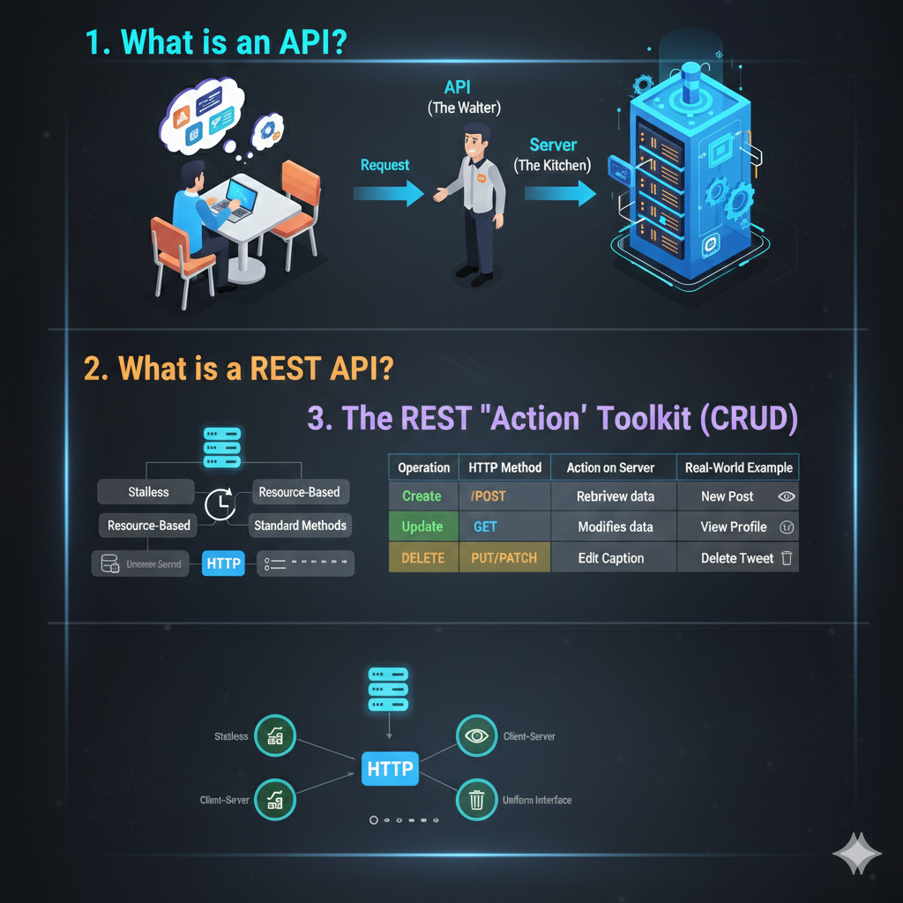

## 🚀 The APIs Guide

### 1. What is an API?

An **API (Application Programming Interface)** is a set of rules and protocols that enables different software programs to communicate and exchange data with each other.

**The "Waiter" Analogy:**

* **The Client (You):** Sits at the table and makes a request (orders food).
* **The Server (The Kitchen):** Receives the order, processes it, and prepares the food.
* **The API (The Waiter):** Takes your request to the kitchen and brings the response (the food) back to your table.

---

### 2. What is a REST API?

**REST** (**RE**presentational **S**tate **T**ransfer) is a specific architectural style for APIs that talk over the internet using **HTTP**.

**Key Characteristics:**

* **Stateless:** Every request from the client must contain all the information the server needs to understand it.
* **Resource-Based:** Everything (users, notes, posts) is treated as a "resource" with its own unique URL.
* **Standard Methods:** It uses standard HTTP verbs (GET, POST, etc.) to perform actions.

---

### 3. The REST "Action" Toolkit (CRUD)

In the world of data, we perform **CRUD** operations. REST maps these operations to specific HTTP methods.

| Operation | HTTP Method | Action on Server | Real-World Example |
| --- | --- | --- | --- |
| **C**reate | **POST** | Submits new data to the server. | Creating a new Instagram post. |
| **R**ead | **GET** | Retrieves data from the server. | Viewing your friend's profile. |
| **U**pdate | **PUT / PATCH** | Modifies existing data. | Editing a caption on your photo. |
| **D**elete | **DELETE** | Removes data from the server. | Deleting an old tweet. |

---

### 4. Anatomy of a REST URL

REST uses a clean, predictable structure for URLs. Let’s look at your **Notes API** as an example:

| Goal | Method | Endpoint (URL) | Logic |
| --- | --- | --- | --- |
| **Fetch all notes** | `GET` | `/notes` | Returns the entire array. |
| **View one note** | `GET` | `/notes/1` | Returns only the note with ID 1. |
| **Save a new note** | `POST` | `/notes` | Adds `req.body` to the array. |
| **Edit a note** | `PUT` | `/notes/1` | Overwrites note #1 with new data. |
| **Remove a note** | `DELETE` | `/notes/1` | Removes note #1 from the list. |

---

### 🧠 Summary for Developers

* **API** is the **Messenger**.
* **REST** is the **Language/Grammar** the messenger uses.
* **JSON** is the **Package** the messenger carries.
* **HTTP Methods** are the **Instructions** on the package.

