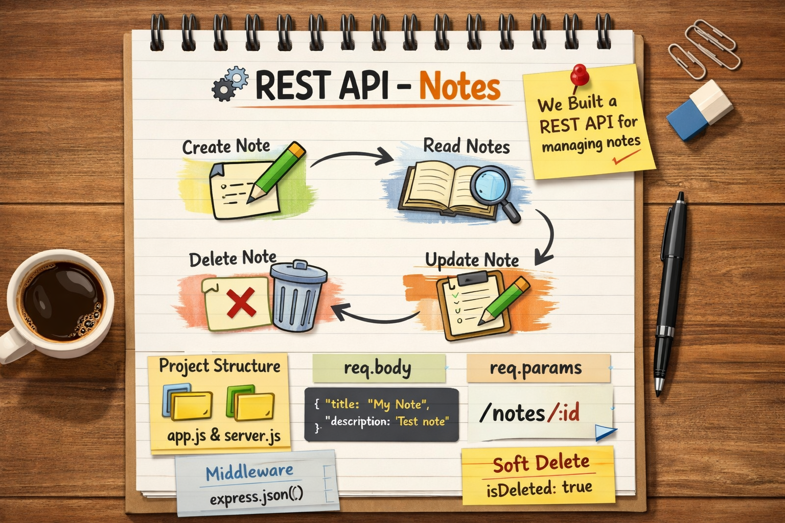

🧠 REST API – Notes
🌐 What we built today

Today we created a server and inside that server we built a simple REST API.

* Using this API, we can:
- Create a note
- Read notes
- Update a note
- Delete a note

📁 Project Structure
app.js
This file is used to:
Create the server application
Configure the server

Example:
const express = require("express");
const app = express();
app.use(express.json());
module.exports = app;

server.js

This file is used to:
Start the server
Run the server on a specific port

Example:
const app = require("./app");
app.listen(3000, () => {
  console.log("Server is running on port 3000");
});

⚙️ Middleware
app.use(express.json());

* This is a middleware
- It allows the server to understand JSON data sent in requests
- Without this, req.body will not work

📦 req.body
* We use req.body when:
- The client sends data in the request body
- Usually used with POST, PUT, PATCH

Used when sending:
- JSON objects
- Forms
- Large data

Example:
app.post("/notes", (req, res) => {
  console.log(req.body);
});

🔗 req.params
* We use req.params when:
- Data is sent through the URL
- Used to get single values like:
- ID
- Index
- Username

Example:

app.delete("/notes/:index", (req, res) => {
  console.log(req.params.index);
});

❗ Understanding Delete & Null Concept
* In backend systems:
* Sometimes data is not permanently deleted
* Instead, it is marked as:
- null
- inactive
- isDeleted: true
- This is called soft delete.

👉 Why?
- To keep history
- To recover data later
- To avoid permanent loss

Hard delete = data removed completely
Soft delete = data hidden but still stored

🔥 Summary

* Built a REST API for notes
* Learned server structure (app.js & server.js)
* Understood middleware
* Learned req.body vs req.params* 
* Learned soft delete concept

### =====================================================

## 🌍 1️⃣ HTTP Methods in REST API

* **GET** → Fetch data
* **POST** → Create new data
* **PATCH** → Update partial data
* **PUT** → Replace full data
* **DELETE** → Remove data

👉 REST follows proper HTTP method usage.

---

## 📊 2️⃣ HTTP Status Codes

* 200 → OK (success)
* 201 → Created
* 400 → Bad Request
* 404 → Not Found
* 500 → Server Error

Example:

```js
res.status(201).json({ message: "Note created" })
```

---

## 🧩 3️⃣ Response Format (Best Practice)

Instead of sending plain text:

❌

```js
res.send("note created")
```

✅ Better:

```js
res.status(201).json({
  success: true,
  message: "Note created successfully",
  data: req.body
})
```

👉 Always respond in JSON format in APIs.

---

## 🛡 4️⃣ Validation Concept

Before saving data, we should check:

* Is title present?
* Is description present?
* Is index valid?

Example idea:

```js
if (!req.body.title) {
   return res.status(400).json({ message: "Title is required" })
}
```
---

## ⚠️ 5️⃣ Error Handling Concept

Backend must handle unexpected errors.

Example idea:

```js
try {
   // logic
} catch (error) {
   res.status(500).json({ message: "Internal Server Error" })
}
```

---

## 🔑 7️⃣ REST Naming Convention

Good REST practice:

* `/notes` → get all notes
* `/notes/:id` → get single note
* `/users`
* `/products`

Use plural naming convention.

---

## 🏗 8️⃣ MVC Pattern

* Routes → Handle URL
* Controllers → Handle logic
* Models → Handle data
* Server → Start app

---

## 💡 9️⃣ Difference Between PUT and PATCH

Add this small but powerful note:

* **PUT** → Replace entire object
* **PATCH** → Update only specific field

Example:

PUT:

```json
{
  "title": "New",
  "description": "New"
}
```

PATCH:

```json
{
  "description": "Updated only this"
}
```

---

# 🔥 10️⃣ Interview Gold Line

> REST API is a stateless communication architecture that follows HTTP methods and resource-based URLs.

---
